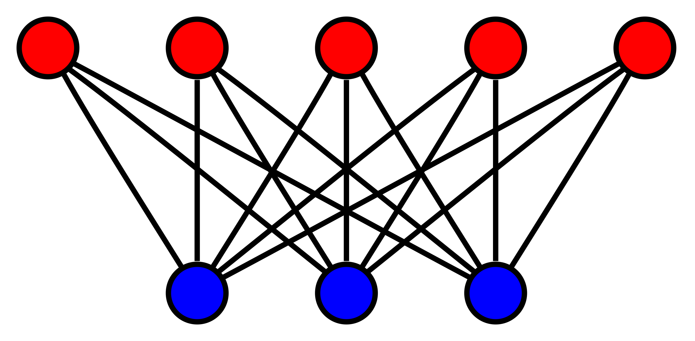
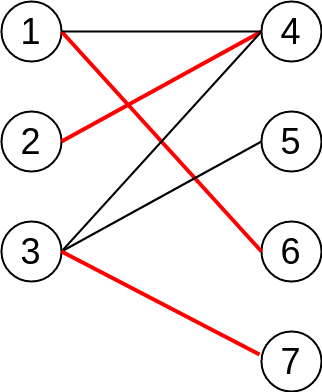
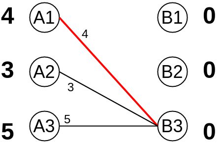
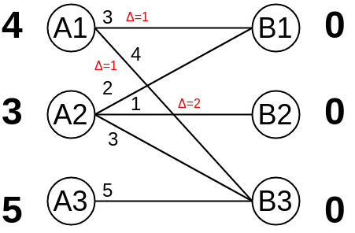
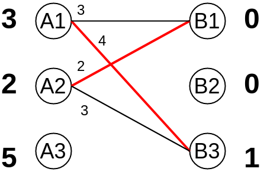
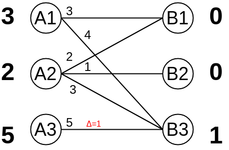
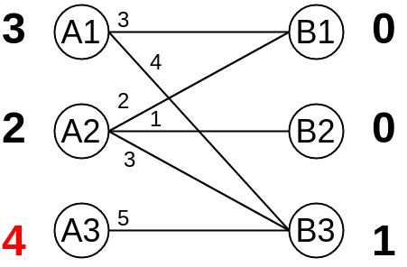
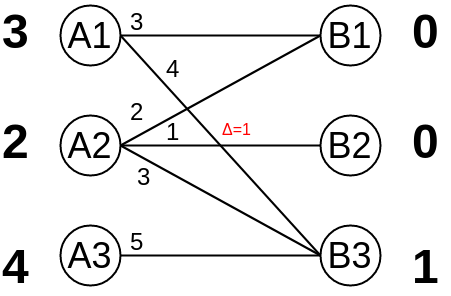
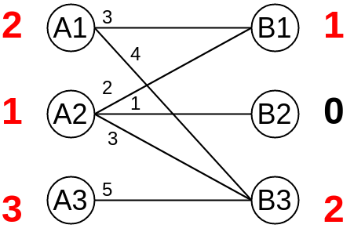
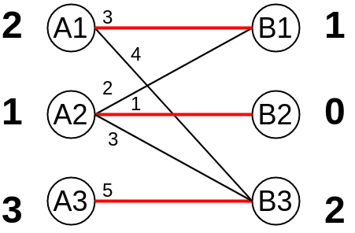

## Introduction

There are three workers: Paul, Dave, and Chris. One of them has to clean the bathroom, another sweep the floors and the third washes the windows, but they each demand different pay for the various tasks. The problem is to find the **lowest-cost** way to assign the jobs.

|       | Clean Bathroom | Sweep floors | Wash windows |
| :---: | :------------: | :----------: | :----------: |
| Paul  |       $2       |      $3      |      $3      |
| Dave  |       $3       |      $2      |      $3      |
| Chris |       $3       |      $3      |      $2      |

The Hungarian method, when applied to the above table, would give the minimum cost: this is 6 dollars, achieved by having Paul clean the bathroom(2 dollars), Dave sweep the floors(2 dollars), and Chris wash the windows(2 dollars).

> There are two ways to formulate the problem: as a *matrix* or as a *bipartite graph*. The problem is easier to describe if we formulate it with a bipartite graph.

We have a **complete bipartite graph** $G=(S, T, E)$ with $n$ worker vertices $(S)$ and $n$ job vertices $(T)$, and each edge $(E)$ has a non-negative cost $c(i,j)$. We want to find a **complete matching with a minimum total cost**.

## Prerequisite

### Complete Bipartite Graph

From  [wikipedia](https://en.wikipedia.org/wiki/Complete_bipartite_graph), a **complete bipartite graph** is a special kind of bipartite graph whose vertices can be partitioned into two subsets $V_1$ and $V_2$ such that no edge has both endpoints in the same subset, and every possible edge that could connect vertices in different subsets is part of the graph. That is, it is a bipartite graph $(V_1, V_2, E)$ such that for every two vertices $v_1 \\in V_1$ and $v_2 \in V_2$, $v_1$ and $v_2$ is an edge in *E*.

### Complete Matching

The definition comes from the [book by Narsingh Deo](http://www.amazon.in/Theory-Applications-Engineering-Computer-Science/dp/8120301455):

In a bipartite graph with vertex partition $V_1$ and $V_2$,  where $|V_1| \leq |V_2|$, a **complete matching of vertices in set $V_1$ into $V_2$** is a matching in which there is one edge incident with every vertex in $V_1$. In other words, every vertex in $V_1$ is matched against some vertex in $V_2$.

> 1. Every complete matching is maximum matching. 
> 2. Maximum matching may not necessary to be complete matching.
> 3. However complete matching equals to maximum matching in **complete bipartite graph**

Note that, complete matching becomes **perfect matching** if $|V_1| = |V_2|$

### Vertex Labelling

For each vertex we assign some number called a label $l$, and let’s call this labelling **feasible** if it satisfies the following condition:

$$l(x) + l(y) \geq \text{weight(x, y)}$$

In other words, the sum of the labels of the vertices on both sides of a given edge are greater than or equal to the weight of that edge.

### Equality Subgraph

Let assume $G^{*} = (V,E^\*)$ is a spanning subgraph of $G$, where $G^\*$ includes all vertices from $G$. 

If in $G^\*$ , all of the edges $E^\*$ satisfy the following condition: 

$$l(x) + l(y) == \text{weight(x, y)}$$

Then we call $G^\*$ as an **equality subgraph** of $G$. Which means $G^\*$ only includes those edges from the bipartite matching which allow the vertices to be **perfectly feasible**. 

## KM(Kuhn–Munkres) Algorithm

KM(Kuhn–Munkres) algorithm provides the connection between equality subgraphs and maximum-weighted matching:

> $G^\*$ is an equality subgraph of bipartite graph $G$.
>
> If $M^\*$ is a complete matching in $G^\*$, then $M^\*$ is a maximum-weighted matching in $G$. 

KM(Kuhn–Munkres) algorithm has following steps:

1. Initialize feasible vertex labelling, where $$l(x) = \min (w(x, y)), (x, y) \in E $$ and $$l(y) = 0$$.

2. Try to find complete(maximum) matching $M$ by using Hungarian algorithm in the equality subgraph.

3. If $M$ does not exist, then update the vertex labelling to include others edges. The idea is to iterate augment path and add all visited vertices on each side into sets $S$ and $T$, then update the vertex labelling:

   $$\Delta = \min_{x \in S, y \in T} ( l(x) + l(y) - w(x, y)) $$

   $$ L(v) = \begin{cases} L(v) - \Delta & \text{if }v \in S \\ L(v) + \Delta & \text{if }v \in T \\ L(v) & \text{otherwise } \end{cases} $$

4. Repeat step 2 and step 3, until we find complete matching.

The key idea of KM(Kuhn–Munkres) algorithm is to utilize Hungarian algorithm while maintaining equality subgraphs. If you are not familiar with Hungarian algorithm, you can review my [previous post.](http://localhost:1313/post/hungarian-algorithm-1/)

### Proof

Let's assume $M^\*$ is a complete matching in $G^\*$, obviously, $M^\*$ is also a complete matching in $G$, and note that in the equality subgraph $G^\*$:

$$l(x) + l(y) == \text{weight(x, y)}$$

Remember that the vertices remain **perfectly feasible** during calculation, so that the sum of the edge weights always equals to the sum of all vertices labelling value:

$$ W(M^{*}) = \sum_{e \in M^{*}} W(e) = \sum_{ v \in V(G) } L(v) $$

$M$ can be any complete matching in the original graph $G$, we have feasible labelling:

$$l(x) + l(y) \geq \text{weight(x, y)}$$

Then we can proof that:

$$ W(M) = \sum_{ e \in M } W(e) \leq \sum_{ v \in V(G) } L(v) = W(M^{*}) $$

Thus the problem of finding an optimal assignment is reduced to the problem of finding a
feasible vertex labelling whose equality subgraph contains a complete matching.

## Example

So first of all, the vertex labelling on left side equals to the maximum weights from connected edges, and right side is 0 at the beginning.

OK, so the equality subgraph looks like:

And obviously, we are able to match vertex $A_1$ with $B_3$. However, we cannot find an augment path when trying to match $A_2$, which indicates that we have to update equality subgraph by modifying vertex labelling. Note that $S = (A_1, A_2)$ and $T = (B_3)$ at this point.

Let's go back to the original graph, and we can easily get the minimal delta value is:

$$ \Delta = 1 $$

 After update:

Then what's the new equality subgraph looks like?

Again, we notice that there are 2 matches: $A_1$ to $B_3$ and $A_2$ to $B_1$, unfortunately we are not able to find any matching for $A_3$. In current stage, $S = (A_3)$ and $T = ()$. 

Similarly, $$ \Delta = 1 $$

After update $A_3$:

New equality subgraph:

We trying to find augment path from A3 -> B3 -> A1 -> B1 -> A2, but failed because it ends up with a matched vertex $A_2$. $S = (A_1, A_2, A_3)$ and $T = (B_1, B_3)$. Let's go back to original graph one more time :smiley:

Updating $S = (A_1, A_2, A_3)$ and $T = (B_1, B_3)$:

And from the graph above, we should notice that it includes all edges from the original graph. We will find the final maximum-weighted matching if we can find the complete matching from current graph!

We apply Hungarian algorithm one more time, and the final complete matching will be: $A_1$ to $B_1$, $A_2$ to $B_2$ and $A_3$ to $B_3$, with its maximum cost of $9 = 3 + 1 + 5$.

## Application Experience
1. Kuhn-Munkres algorithm deals with the maximum-weighted matching problem, what if I need to calculate minimal-weighted matching?  

   $$w(x, y) = -w(x, y), \forall (x, y) \in E$$

2. What if I want to calculate the maximum-product-weighted matching? 

   $$w(x, y) = log(w(x, y)), \forall (x, y) \in E$$

3. What if the graph is not Complete Bipartite Graph? Answer: assign missing edges as weights of 0.

## References

1. [Hungarian algorithm Wikipedia](https://en.wikipedia.org/wiki/Hungarian_algorithm)
2. [KM算法详解+模板](https://www.cnblogs.com/wenruo/p/5264235.html)
3. [带你入门多目标跟踪（三）匈牙利算法&KM算法](https://zhuanlan.zhihu.com/p/62981901)
4. [topcoder - assignment problem and hungarian algorithm](https://www.topcoder.com/community/competitive-programming/tutorials/assignment-problem-and-hungarian-algorithm)
5. [Kuhn-Munkres算法(二分图最大权匹配)](http://www.cnblogs.com/kuangbin/archive/2012/08/19/2646535.html)
6. [二分图的最佳完美匹配——KM算法](https://blog.csdn.net/sixdaycoder/article/details/47720471)
7. [二分图大讲堂——彻底搞定最大匹配数（最小覆盖数）、最大独立数、最小路径覆盖、带权最优匹配](https://www.iteye.com/blog/dsqiu-1689505)
8. [UVA1411 Ants - 二分图最优匹配 / 最小权值匹配](https://acm.taifua.com/archives/uva1411.html)
9. [图论在计算广告中的应用](https://zhuanlan.zhihu.com/p/23562855)
10. [DM-64-Graphs Complete Matching](https://www.youtube.com/watch?v=Q03gdAhILB4)
11. [dlib - max cost assignment](http://dlib.net/max_cost_assignment_ex.cpp.html)